# 🎯 DocDirect - Doctor Appointment Booking System

🚀 **DocDirect** is a powerful and intuitive desktop application built using **JavaFX** and **MySQL**, designed to simplify doctor appointment bookings. It provides a seamless user experience for browsing doctors, viewing details, and scheduling appointments with **secure payment integration**. Additionally, we offer flexible **yearly, quarterly, and bi-yearly subscription packages**, making it more adaptable to modern healthcare service needs.

---
## 🌟 Inspiration

💡 The idea behind **DocDirect** was inspired by **[Praava Health](https://www.praavahealth.com/)**, a modern healthcare service provider that emphasizes accessible and efficient medical solutions. While developing this desktop application, multiple reference images from **Praava Health's** products were used to shape the user experience and interface design. Their approach to patient-centered healthcare served as a strong foundation for this project. 🚀

---
## ✨ Features

✅ **Doctor Listings**: Easily browse through a list of available doctors with brief descriptions.  
✅ **Doctor Details Page**: View comprehensive profiles including specialization, consultation fees, qualifications, and schedules.  
✅ **Appointment Booking**: Select available slots and confirm appointments instantly.  
✅ **Secure Payment Integration**: Supports **bKash, Nagad, Rocket**, and **online banking** for seamless transactions.  
✅ **Subscription Plans**: Choose from **yearly, quarterly, and bi-yearly** packages for hassle-free healthcare access.  
✅ **User Authentication**: Secure login system for personalized access.  
✅ **Database Integration**: Efficient **MySQL database** for managing doctor details, appointments, and transactions.


---

## 🛠️ Technologies Used

🔹 **JavaFX** - For smooth and dynamic UI development  
🔹 **MySQL** - Robust database management  
🔹 **Java** - Powerful backend logic  
🔹 **IntelliJ IDEA Ultimate** - Primary development environment  
🔹 **Git & GitHub** - Version control and collaboration

---

## 🔗 API Integration

Doctor data is fetched dynamically from the API endpoint:

```
http://nayeemcode.pythonanywhere.com/data?file=sujon&key=jhbfhsdjdjsadbjsd
```

---

## 🚀 Installation & Setup

- Clone this repository:
   ```sh
   git clone https://github.com/yourusername/DocDirect.git
   ```
- Open the project in **IntelliJ IDEA Ultimate**.

-  Configure the **MySQL database** and update the connection settings in the application.

- Run the project using **JavaFX**.

---

## 🖼️ Screenshots
### 1.The Login Page
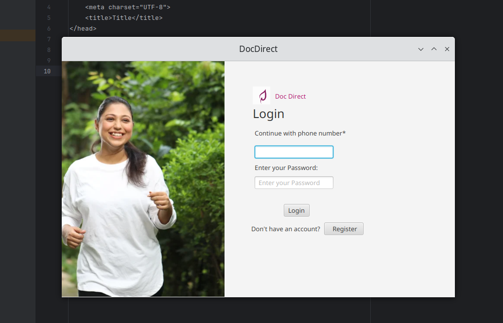
### 2.Registration Page
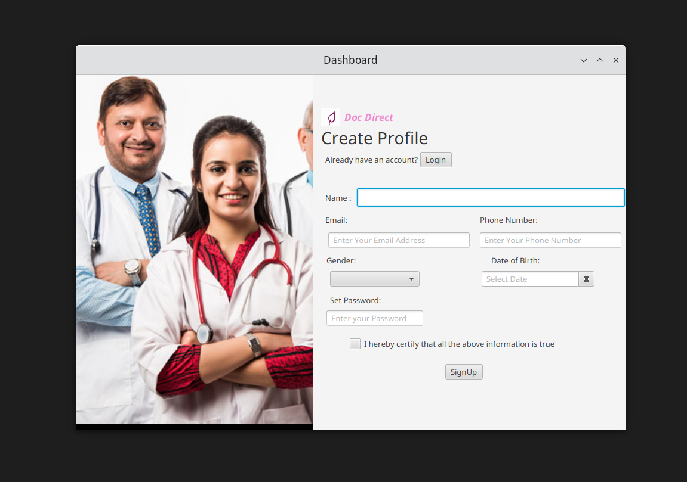
### 3.Dashboard
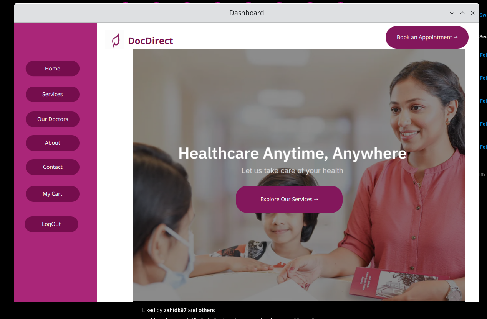
### 4.Services - HealthCare Packages
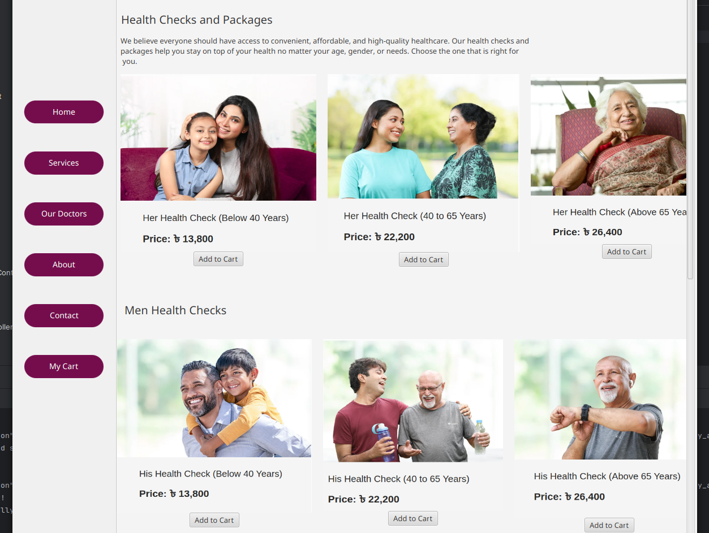
### 5.Services - Special HealthCare Packages

### 6.Membership Packages
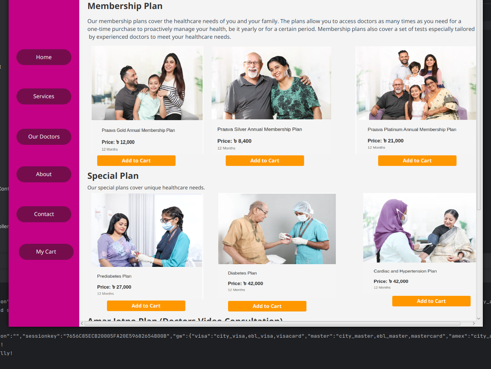
### 7.Our Doctors
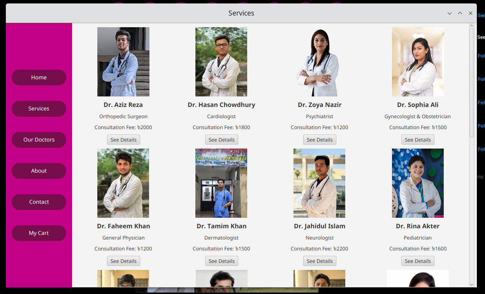
### 8.Our Doctors - See Details
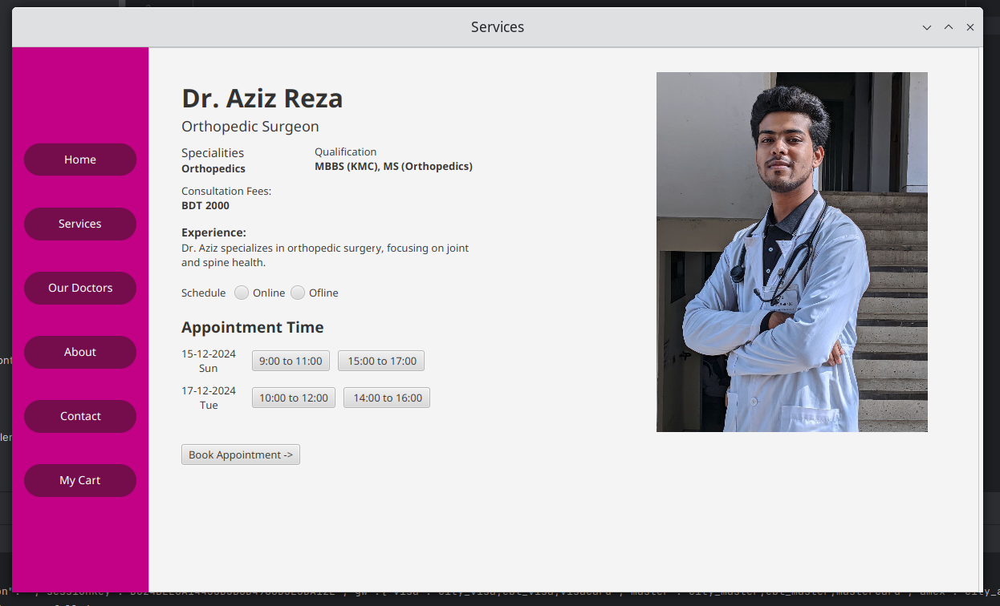
### 9.Our Doctors - See Details - Book Appointment
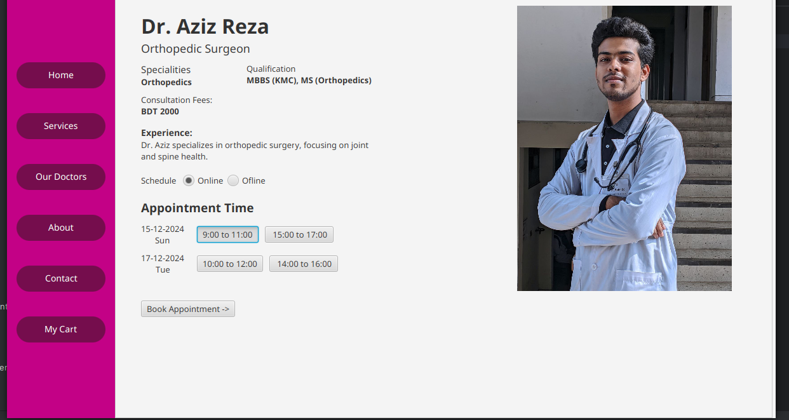
### 9.CheckOut or Proceed to Payment
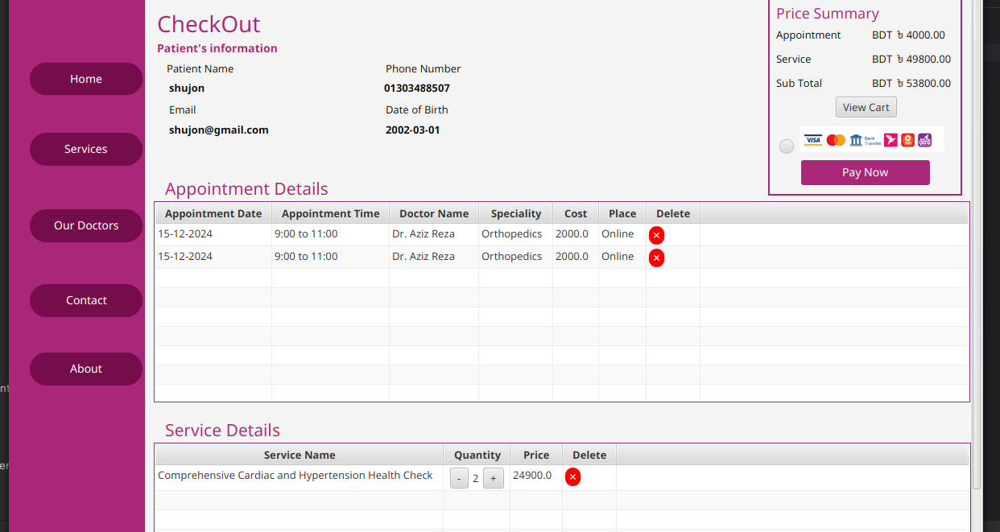
### 10.My Cart
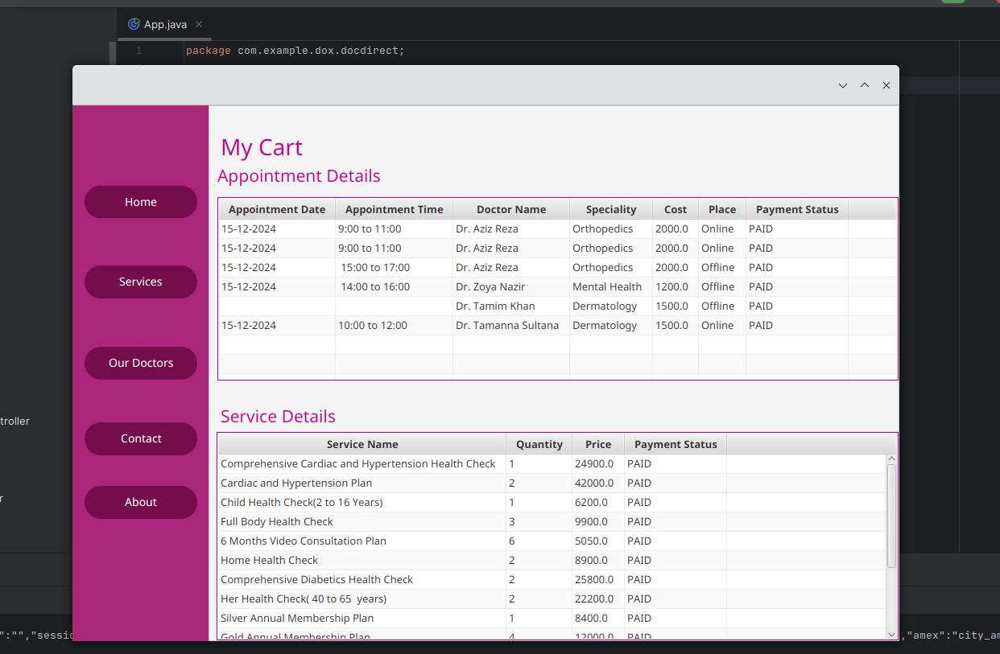
### 11.Dynamic Price Summary with SSL E-commerz option
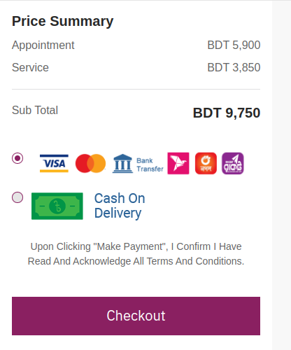
### 12. SSL E-commerz - Cards
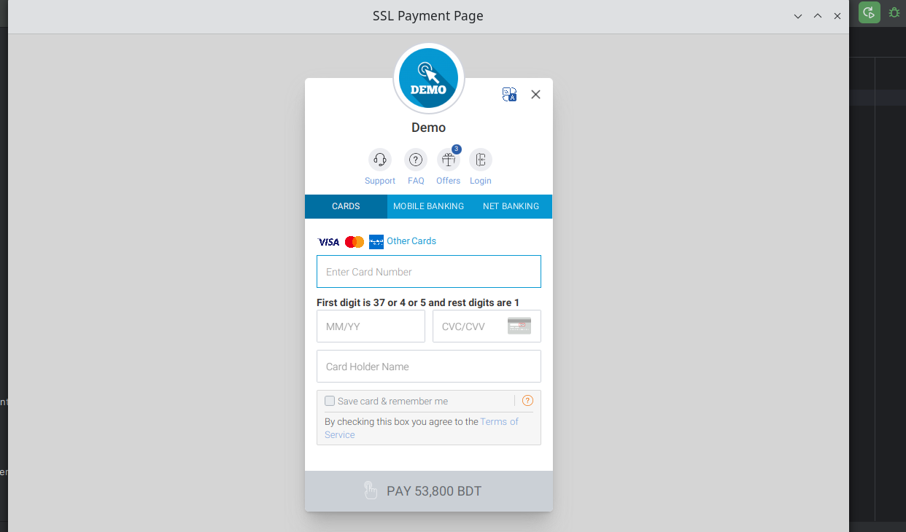
### 13. SSL E-commerz - Mobile Banking
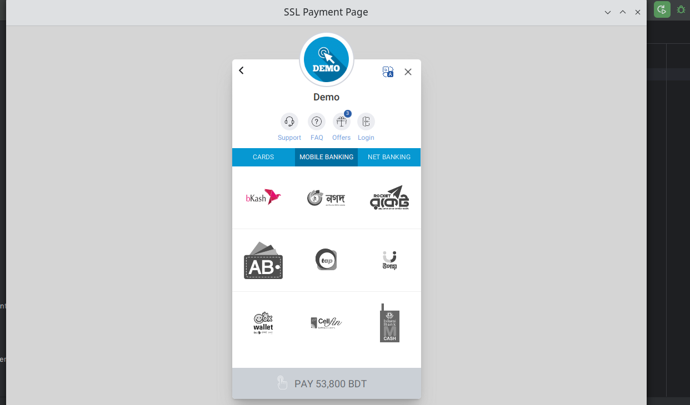
### 14. SSL E-commerz - OTP Page
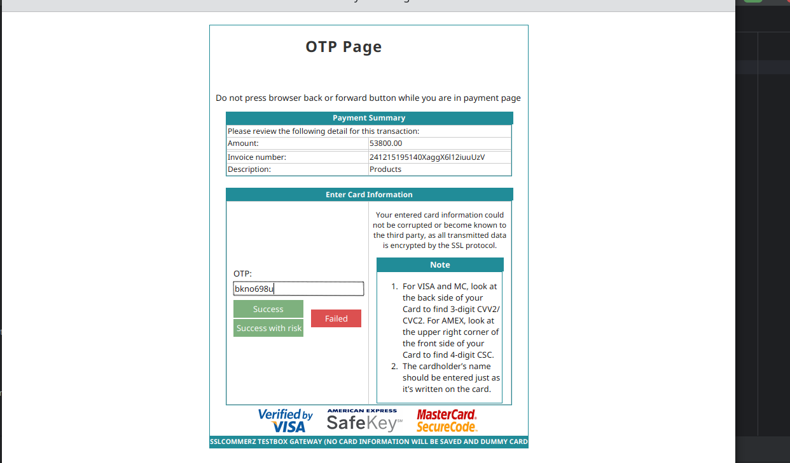

---
## 🎥 Video Demo

📹 Watch the application in action: [Google Drive Link](https://drive.google.com/file/d/197sZgBH5CF77WtfC4CavYzLGptnw0jvs/view?usp=drive_link)


---

## 🤝 Contributing

💡 Contributions are **highly encouraged**! If you'd like to enhance the project, feel free to **fork** the repository and submit a **pull request**. Let's make DocDirect even better! 🚀

---

## 📜 License

📄 This project is licensed under the **[MIT License](LICENSE)**.

---

## 📞 Contact

For any inquiries or support, feel free to reach out:

📧 **Email**: [skt104.shujon@gmail.com](mailto:your.email@example.com)  
🔗 **GitHub**: [Shakhoyat](https://github.com/Shakhoyat)

---

✨ *Thank you for using DocDirect! Your health, your way.* 💙

